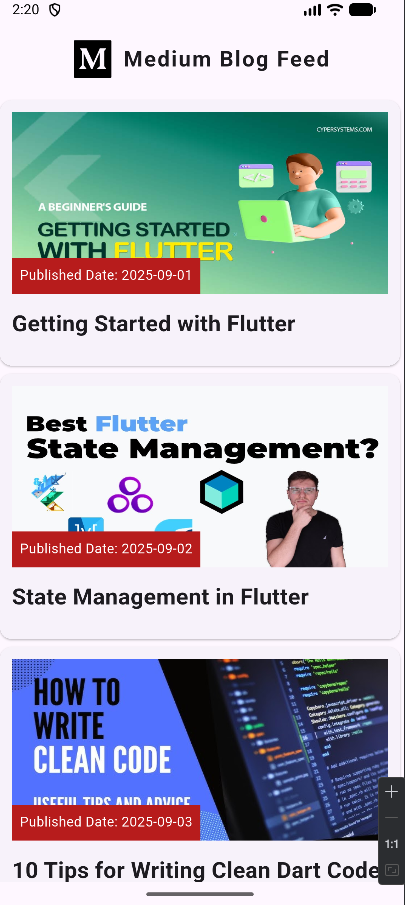
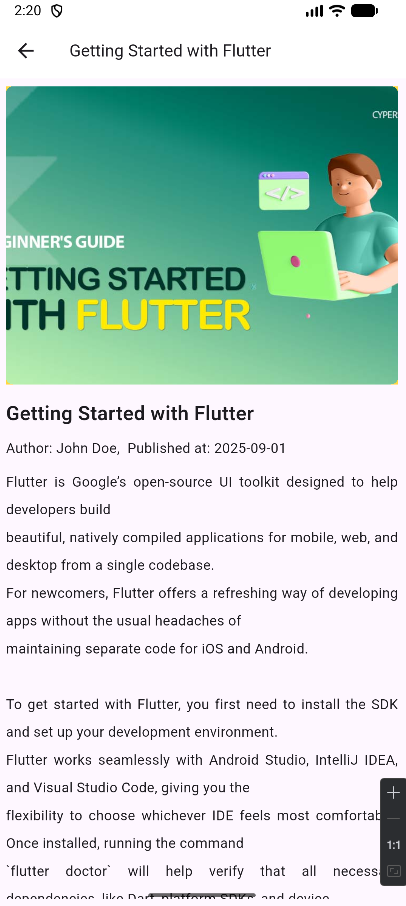

<h1 align="center" style="font-size: 52px;" > Medium Blog Feed - Flutter App</h1>

Its a Flutter app with integration of Medium Blog Feed using RSS2Json API end point. Written <a href="https://mhamzadev.medium.com/integrate-medium-blog-feed-in-flutter-app-mvc-architecture-3e0b3c90bfa3">medium article</a> for furhter details :)

`https://api.rss2json.com/v1/api.json?rss_url=https://medium.com/feed/@username`

## 📱 Screenshots

 

## 🧑 Author

#### Imam Uddin Helal
[![Portfolio Link]](https://imam-uddin-helal.vercel.app/)

You can also follow my GitHub Profile to stay updated about my latest projects:

[![GitHub Follow]]
(https://github.com/flutter-cake)

If you liked the repo then kindly support it by giving it a star ⭐!

Copyright (c) 2020 Imam Uddin Helal